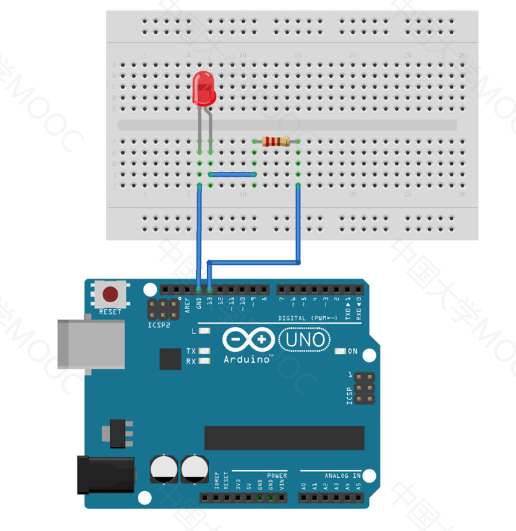
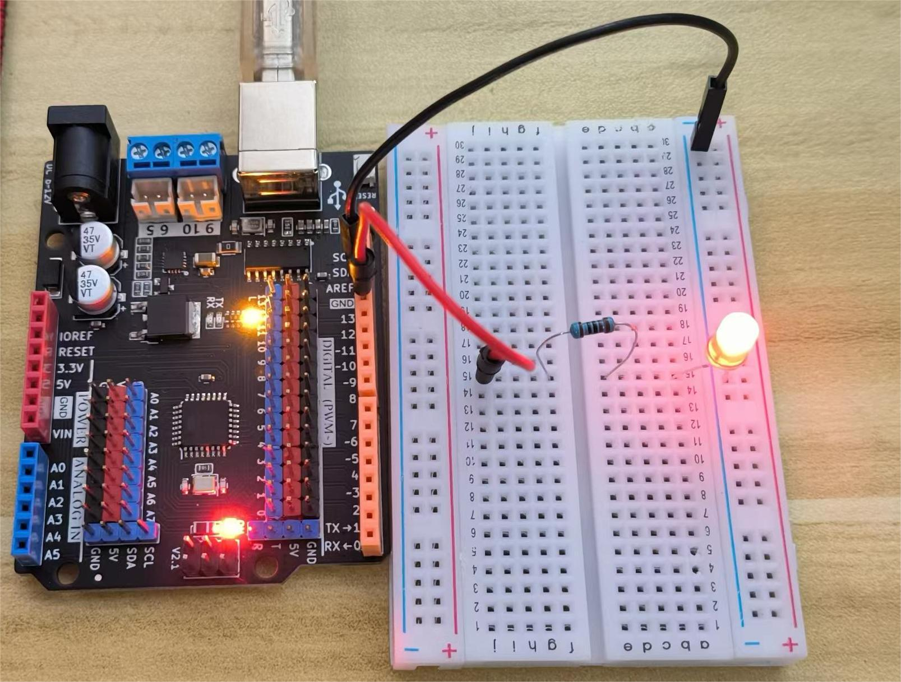
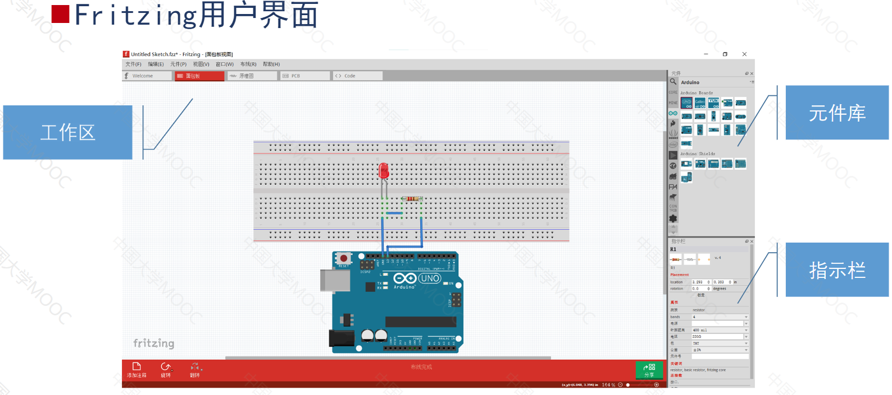
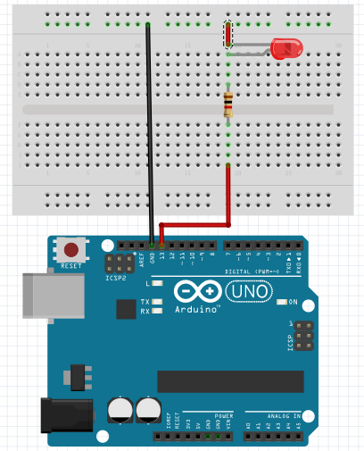
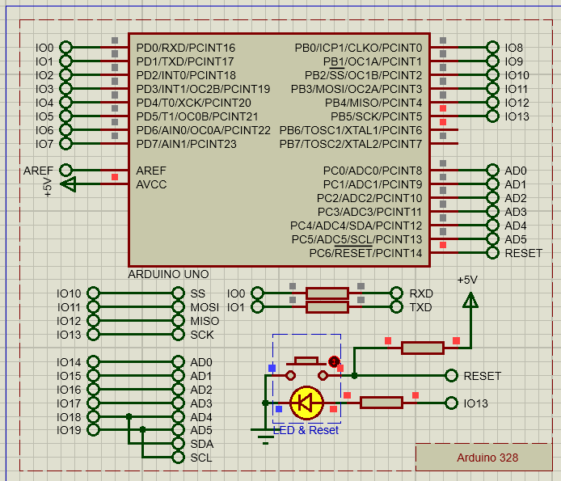

# 2.点亮LED—代码结构、电路设计软件（Fritzing）和仿真软件(Proteus)

##### 1.准备材料

- 开发板和下载线（就是连接电脑的USB线）
- LED灯
- 杜邦线
- 330Ω电阻
- 面包板

##### 2. 接线



##### 3. Arduino 程序结构

```c++
// 1.程序启动时，先执行setup中的内容，一般为初始化变量、定义引脚模式、启动模块等
void setup() {
 
}
// 2. 然后程序会循环执行loop中的内容
void loop() {
    
}
```

##### 4. Blink代码

```c++
void setup() {
  // 设定13引脚用来输出
  pinMode(13, OUTPUT);
}

void loop() {
  digitalWrite(13, HIGH); // 13引脚接高电平，亮
  delay(2000);  // 延时 2000ms,即 2s

  digitalWrite(13, LOW); // 13引脚接低电平，灭
  delay(1000);
}
```



##### 5.电路设计软件(Fritzing)

- 开源电路设计软件，Windows、Linux和Mac版本都有

- [fritzing](https://github.com/fritzing/fritzing-app)
- 
- 

###### 6.仿真软件（Proteus）

- EDA工具软件
  - 原理图布图
  - PCB设计
  - 代码调试
  - 单片机与外围电路协同仿真

- [Proteus-试用版](https://www.labcenter.com/)

- 仿真Blink试验
  - 新建工程
  - “从选中的模板中创建原理图” - DEFAULT
  - “不创建PCB布板设计”
  - “创建固件项目”
    - 系列：ARDUINO
    - Controller: Arduino Uno
    - 编译器：Arduino AVR (Proteus)
    - “完成”
  - 点击“原理图绘制”，发现里边已经添加了Blink的LED（应该是默认的）,ok，不用管。
  - 点击“Source Code”，输入 Blink的代码，“保存”
  - 回到“原理图绘制”--(点击左下角向右的三角按钮)“运行仿真”，可看见原理图上的LED按照设定的代码进行亮灭。
  - 