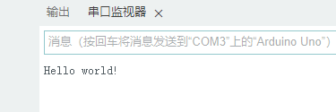

# 3.Arduino定时、中断与串口

##### 1. ATmega 328P中的定时函数

- `Delay`函数在使用时，CPU在一直忙，无法进行其它操作

- **`Millis`/`Micros`函数**

  - 不占用CPU资源，CPU可以执行其它操作，仅需在每个周期检查是否达到定时周期
    - 翻译翻译就是：CPU不用不停数数了，有了块手表，但是得不停得看表，闲了，但是没完全闲，这就需要**定时器中断**
  - **`Millis()`**
    - 用来获取Arduino开机后运行的时间长度，单位 `ms`
    - 系统最长的记录时间为49.71天（49.710天）
    - 超出时间将从0开始
    - 函数返回值为`unsigned long`
  - **原理**：
    - 使用硬件定时器T0（time0），对输入时钟（内部晶振）上升沿进行计数
    - 

- **`Micros()`**

  - 用来获取Arduino开机后运行的时间长度，单位 `μs`(微秒)， 1`s` = 10^6`μs`
  - 系统最长的记录时间为70分钟（71.5827分钟）

  - 超出时间将从0开始

  - 函数返回值为`unsigned long`

- 等效`delay`

  - 通过对两次`Millis`/`Micros`函数所返回的时间做差，可以得到时间差，以完成等效`delay`函数的效果

  - LED Blink代码，`delay`函数修改版

    - ```C++
      int flag;
      unsigned long time_now = 0;
      
      void setup() {
        // 设定13引脚用来输出
        pinMode(13, OUTPUT);
      }
      
      void loop() {
        // 统计当前时刻，与上次LED状态更新的时刻经过的时间>1000ms，达成了delay(1000)的功能
        if (millis() > time_now + 1000) {
          time_now = millis();
          digitalWrite(13, flag ? HIGH: LOW);
          // 对flag变量的值取反（代表了LED所连接的13引脚电平）
          flag = !flag;
        }
      }
      ```

##### 2.中断机制

- **简述**
  - CPU执行程序的时候，当更高优先级来临的时候，CPU停下当前的操作去执行更高优先级的指令
  - 当更高优先级指令执行完后，再继续执行原有的程序

- 使用定时器中断，不需要CPU反复检查是否达到定时周期，而是定时中断CPU程序，直接执行对应中断程序
  - 翻译就是：定个闹钟，闹钟不响CPU不用去“看”，闹钟响了，CPU再去“看”

- Arduino有两种中断，内部中断和外部中断

  - **内部中断函数—定时器中断**
    - `Timer1`库
      - `Timer1.initialize(Period)`
        - 用于初始化定时器，配置定时周期，以微秒为单位(`μs`)
        - 调用后自动启动定时器
      - `Timer1.attachInterrupt(timelsr)`
        - 设置中断回调函数（也就是中断的时候要执行的函数）
      - `Timer1.setPeriod(Period)`
        - 配置定时周期，以微秒(`μs`)为单位
      - `Timer1.start()`
        - 启动定时器
      - `Timer1.stop()`
        - 停止定时器
      - `Timer1.restart()`
        - 重启定时器
      - `Timer1.read()`
        - 读取定时器当前值

- **LED Blink使用中断**

  - ```c++
    #include "TimerOne.h"
    int flag = 0;
    
    void setup() {
      pinMode(13, OUTPUT); // 设置13引脚用来输出
      Timer1.initialize(1000000); // 初始化定时器，每1s进一次中断服务程序
      Timer1.attachInterrupt(callback); // 设置中断回调函数
    }
    
    // 回调函数
    // callback 没有放在loop中，因为callback不用循环执行，只要中断来的时候执行一次就行
    void callback() {
      digitalWrite(13, flag ? HIGH: LOW);
      flag = !flag;
    }
    
    void loop() {
    }
    ```

##### 3. 串口

- Arduino使用`TTL`逻辑电平

  - 高电平：5V或3.3V
  - 低电平：0V

- 一般的RS-232串口使用的是RS-232电器标准

  - 逻辑`1`：-15V~-3V
  - 逻辑`0`：3V~15V
  - 

- **不同串口标准间通信要使用转换芯片**

  

- **Arduino串口通信**

  - 一般是通过串口和计算机通信

  - 但是随着计算机的发展，计算机一般都不提供串口了，而是通过USB口用USB转串口模块来实现Arduino和计算机的通信

  - 

    

  - **Arduino的串口**

    - RX，引脚0

    - TX，引脚1

    - USB口通过转换芯片与这两个引脚连接

    - 

    - **Arduino串口采用串行比特流方式发送数据，每次发送一个比特的数据**

      

- **Arduino串口函数**

  - **`Serial`**

    - `Serial.begin(speed[,config])`

      - 串口波特率定义函数

        - 开启串口
        - 设置串口的
          - 速率
          - 数据位数
          - 奇偶校验
          - 停止位
          - ...

      - 通常置于`setup()`函数中

      - `speed`为波特率，一般取值`9600`、`115200`等

        + 收发端的波特率必须设置为相同的值，否则无法进行正常通信

        + 波特率越高，传输距离越短

          + `9600`，≈75米

          + `110`，≈1000米

            

      - **`config`**

        - `SERIAL_8N1`，缺省值，8个数据位，无校验位，1个停止位
          - 8，每次发送8个比特
          - N，没有校验位[^1]
          - 1，一个停止位
        - `SERIAL_8E1`
          - 8，每次发送8个比特
          - E，Even，**偶校验**位[^2]
          - 1，一个停止位
        - `SERIAL_8O1`
          - 8，每次发送8个比特
          - O，Odd，**奇校验**位[^3]
          - 1，一个停止位

        

    - `Serial.available()`

      - 返回**缓存区**[^4]可读字节数

        - `Serial.available()>0`，说明缓存区有数据

          

    - `Serial.read()`

      - 从串口缓存中读取一个字节的数据，读取的字节会被从缓冲区移除掉

      - 若缓冲区是空的，读取会返回`-1`

        

    - `Serial.write(val)`

      - 将数据以二进制形式输出，也就是该函数可以发送单个字节，也可以发送多个字节

      - 返回发送的字节数

        

    - `Serial.print(val[,format])`

      - 将数据以ASCII文本形式输出

        

    - `Serial.println(val[,format])`

      - 在`Serial.print`的功能的基础上，输出结果时跟上回车与换行

        

    - **`Serial.write` 和`Serial.print`的区别**

      - print，输出真实数值

        - `Serial.print(33)`，结果：33

          

      - write，给出的是ASCII码所对应的数值

        - `Serial.write(33)`，结果："`!`"，ASCII的33对应的是叹号“`!`”

      - println，在print的基础上，额外发送了ASCII的**回车**和**换行**

        

  - **`Serial`实际使用**

    - ```C++
      char c; // 记录接收到的数据
      
      void setup() {
        Serial.begin(9600); // 设置波特率为9600
        while (Serial.read() >= 0); // 清除缓存，只要有缓存就一直读
      }
      
      void loop() {
        while (Serial.available()) {  // 判断串口是否有数据输入
          c=Serial.read();            // 读取输入数据
          if(c=='R')                  // 判断输入是否为R
            Serial.println("Hello world!"); // 通过串口输出 Hello World！ Arduino语法中，如果if下边只执行一条语句，可以不用大括号"{}"包围
        }
      }
      
      ```

    - 如何给开发板发送"R"

      - 
      - 输入R，然后回车
        - 
      - 执行结果
        - 

  - **串口输入数据，控制开发板闪灯频率**

    - ```C++
      #include "TimerOne.h"
      int flag = 0;
      long c = 0; // 接收新的中断间隔
      
      void setup() {
        Serial.begin(9600);
        while(Serial.read()>=0);
        pinMode(13, OUTPUT);
        Timer1.initialize(1000000);
        Timer1.attachInterrupt(callback);
      }
      
      void callback() {
        digitalWrite(13, flag ? HIGH: LOW);
        flag = !flag;
      }
      
      
      void loop() {
        if(Serial.available()>0) {         // [接收] 判断串口是否有数据输入
          c=Serial.parseInt();             // [接收] 读取输入数据，转换为整数
          Serial.println(c);
          while(Serial.read()>=0);         // 清除缓存
          Timer1.setPeriod(c * 1000);      // 设置新的中断间隔, 设置新的中断间隔, 毫秒转换为微秒
          Timer1.attachInterrupt(callback);
        }
      }
      ```

    ---

##### 注释

[^1]: 校验位，指的是在发送数据用二进制表示的时候，它里边的1的个数。
[^2]: 偶校验，数据里边1的个数是**奇数**的话，那这个校验位就是1，如果数据里的1的个数是**偶数**的话，则校验位为0。
[^3]: 奇校验，数据里边1的个数是**偶数**的话，那这个校验位就是1，如果数据里的1的个数是**奇数**的话，则校验位为0。
[^4]: 缓存区，Arduino串口在接收数据的时候，它首先把接收的数据放在缓存区。