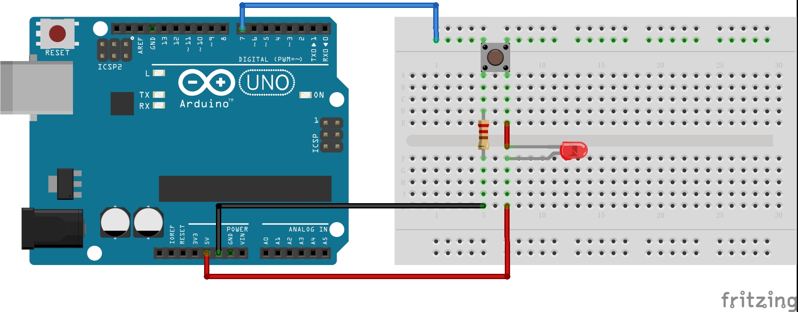
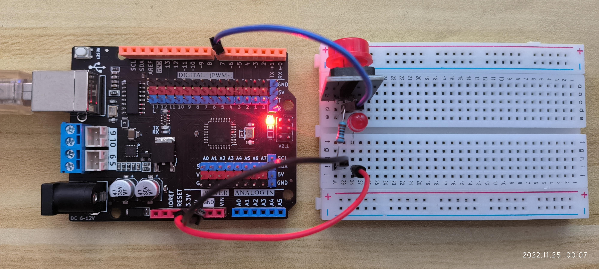

# 4.Arduino输入—按键去抖

##### 1. 按键去抖

- **电路图** 

- 实拍图(这个按键自带电阻，有三个针脚，实际电路和上边一样，只是两个电阻串联，阻值不一样) 

- 为什么会抖动？

  - 因为机械按键的本身原因，在闭合和关闭的时候，都会有抖动

- **如何去抖**

  - **硬件去抖**

    - 用电容搭建滤波器
      - 效果不是很好
      - 而且增加了成本和电路的复杂度

  - **软件去抖**

    - 首先读取按键状态，

    - 当检测到按键摁下后，等待10ms

    - 再次读取按键状态，若此时仍然是按下状态，则说明是按键按下了，否则，即为抖动

    - 具体代码

      - **延迟检测法**

        - ```C++
          # include "TimerOne.h"
          
          int BUTTON=7;   // 定义按钮在7号引脚，连接一个下拉电阻
          int val=0;      // 存储按钮的状态
          int old_val=0;  // 暂存val变量的上一个时间状态
          int i=0;        // 计数 
          int check_interval = 10*1000;   // Time1.initialize的时间单位是微秒
          
          void setup() {
            pinMode(BUTTON,INPUT_PULLUP); // INPUT PULLUP,输入上拉模式
            Serial.begin(9600);           // 用于串口输出
            // 采用中断的方式延迟检测
            Timer1.initialize(check_interval);
            Timer1.attachInterrupt(callback);
          }
          
          void callback() {
            val = digitalRead(BUTTON);    // 读取输入模式并且存储
            if((val==HIGH) && (old_val==LOW)) { // 检查按钮的变化情况
              i++;
              Serial.println(i);
            };
            old_val=val;
          }
          
          // 采用delay延迟
          void loop() {
            // val = digitalRead(BUTTON);    // 读取输入模式并且存储
            // if((val==HIGH) && (old_val==LOW)) { // 检查按钮的变化情况
            //   delay(10);                        // 改成用中断
            //   i++;
            //   Serial.println(i);
            // };
            // old_val=val; // 存旧值
          }
          
          ```

      - **Arduino 自带去抖函数**

        - 首先要安装`bounce2`库，用IDE自带的库搜索搜到之后直接安装就行

        - ```C++
          # include <Bounce2.h>
          # define BUTTON_PIN 7
          
          int i = 0; // 统计按键次数
          Bounce b = Bounce(); // 实例化一个Bounce对象
          
          void setup() {
            b.attach(BUTTON_PIN, INPUT_PULLUP);
            b.interval(10);
            Serial.begin(9600);
          }
          
          void loop() {
            b.update();   // 读取按键状态, Update the Bounce instance
            if (b.fell()) { //  通过fell函数判断按键是否按下，Call code if button transitions from HIGH to LOW
              i++;
              Serial.println(i);
            };
          }
          ```