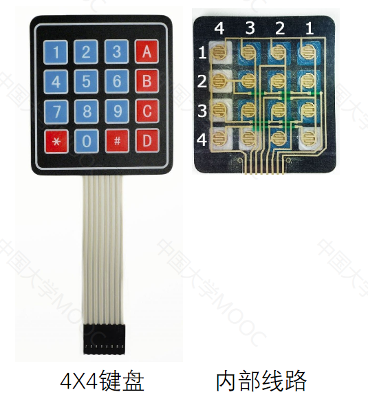
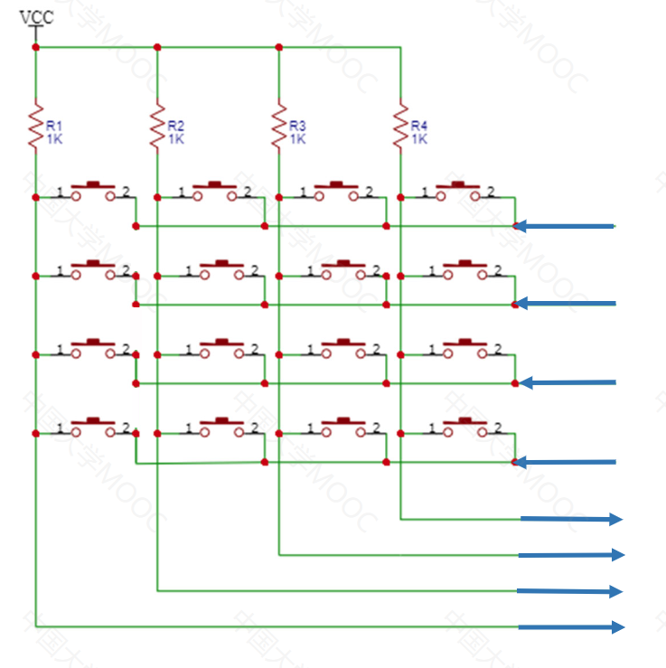
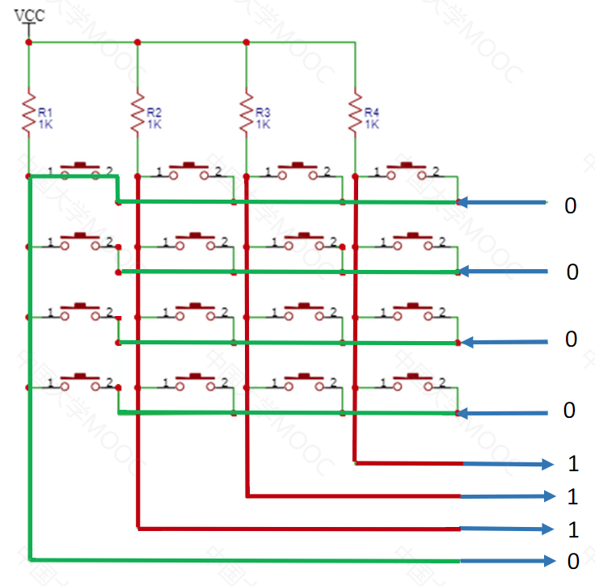
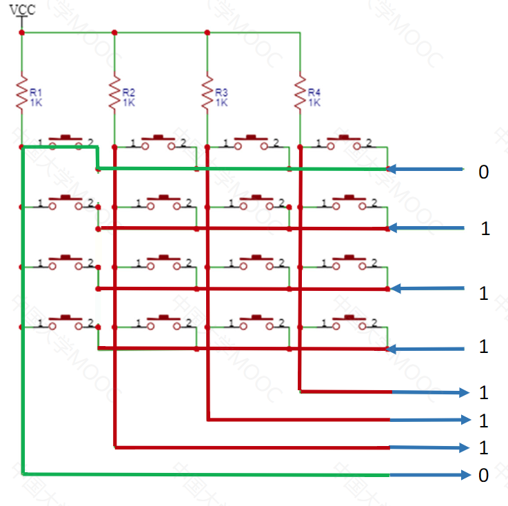
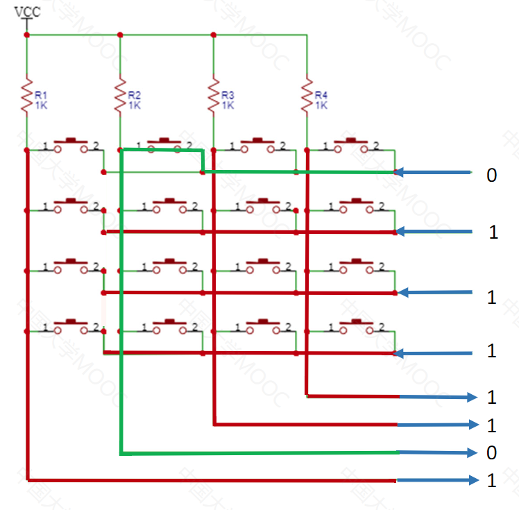
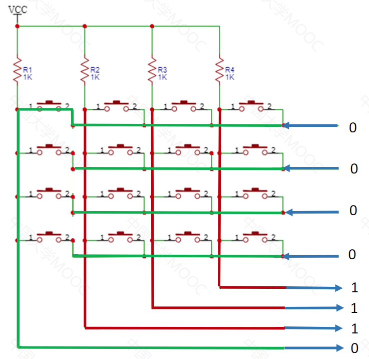
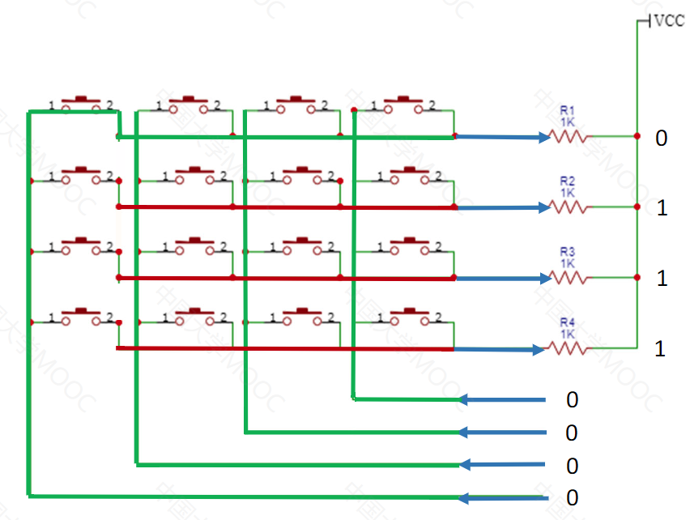
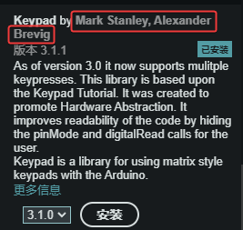
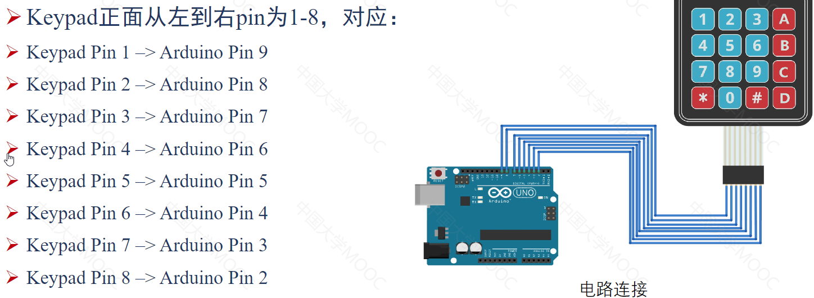

# 5.Arduino输入-矩阵键盘

##### 1. **4X4键盘线路图**



##### 2. 如何判断哪个键被按下去

- 对于单片机内部集成了上拉电阻的电路，外置键盘可以没有上拉电阻。这里的上拉电阻是为了获得高电平
  - 

- **扫描法**，分两步

  - 

  - 第一步，**判断有没有按键按下**

    - 输入键盘全部为低电平
    - 若没有按键按下，输入Arduino的电平均为高电平
    - 某一列按下，则对应列的输入电平为低电平
      - 

  - 第二步，**判断按键的位置**

    - 让其中一根行线为低电平，其它为高电平

      - 

    - 输入给Arduino的电平为低电平的列线，即代表了按键的列数，因为行为高电平的不在按键按下列的，即使有按键按下，也是高电平，不影响结果

      - 

    - 多次换其它某一行为低电平进行验证，得到，行为低电平的行有按键按下能检测到，其它行检测不到

      

- **反转法**

  - 先行输入，列输出，**确定按键在哪一行**

    - 

  - 然后列输入，行输出，**确定按键在哪一列**

    - 

      

- **同样，矩阵键盘也要注意按键防抖**

- **为了确定按下了哪个键，我们需要连续扫描行和列**

  

##### 3. Arduino 自带的键盘函数库—`Keypad.h`

- 不仅实现了扫描而且实现了防抖
- 安装
  - 项目 -> 加载库 -> 管理库，搜“keypad”，然后点击正确的库安装即可
    - 安装这个版本
      - 
- **硬件准备**
  - Arduino开发板
  - 4X4矩阵键盘
  - USB线（连接电脑和开发板）
  - 杜邦线

- 硬件连接

  - 

  

- `Keypad.h`参数说明

  - Keypad(makeKeymap(keys), rowPins, colPins, ROWS, COLS)

    - ROWS，行数

      - `const byte ROWS = 4; //四行`

        

    - COLS，列数

      - `const byte COLS = 4; //四列`

        

    - rowPins，连接到矩阵键盘的行的引脚

      - `byte rowPins[ROWS] = {9, 8, 7, 6};`

        

    - colPins，连接到矩阵键盘的列的引脚

      - `byte rowPins[COLS] = {9, 8, 7, 6};`

        

    - makeKeymap(keys)，将键盘上的键映射为有意义的字符

      - ```c
        char keys[ROWS][COLS] = {
            {'1', '2', '3', 'A'},
            {'4', '5', '6', 'B'},
            {'7', '8', '9', 'C'},
            {'*', '0', '#', 'D'}
        };
        ```

  - `getKey()`用于检查按下了哪个键

##### 4. 代码

- ```C
  #include <Keypad.h> // 声明库函数
  
  const byte ROWS = 4; //四行
  const byte COLS = 4; //四列
  char keys[ROWS][COLS] = {
      {'1', '2', '3', 'A'},
      {'4', '5', '6', 'B'},
      {'7', '8', '9', 'C'},
      {'*', '0', '#', 'D'}
  };
  byte rowPins[ROWS] = {9, 8, 7, 6}; // 连接到矩阵键盘的行的引脚
  byte colPins[COLS] = {5, 4, 3, 2}; // 连接到矩阵键盘的列的引脚
  
  Keypad keypad = Keypad(makeKeymap(keys), rowPins, colPins, ROWS, COLS);
  
  void setup() {
    Serial.begin(9600);
  }
  
  void loop() {
    char key = keypad.getKey();
    if(key){
      Serial.print("Key Pressed: ");
      Serial.println(key); // 将得到的字符发送到串口
    }
  }
  
  ```

- 这个代码有点小BUG，重复按相同的按键，然后下一次按别的按键，第一下还是输出的上次的按键值，而不是本次的按键值
