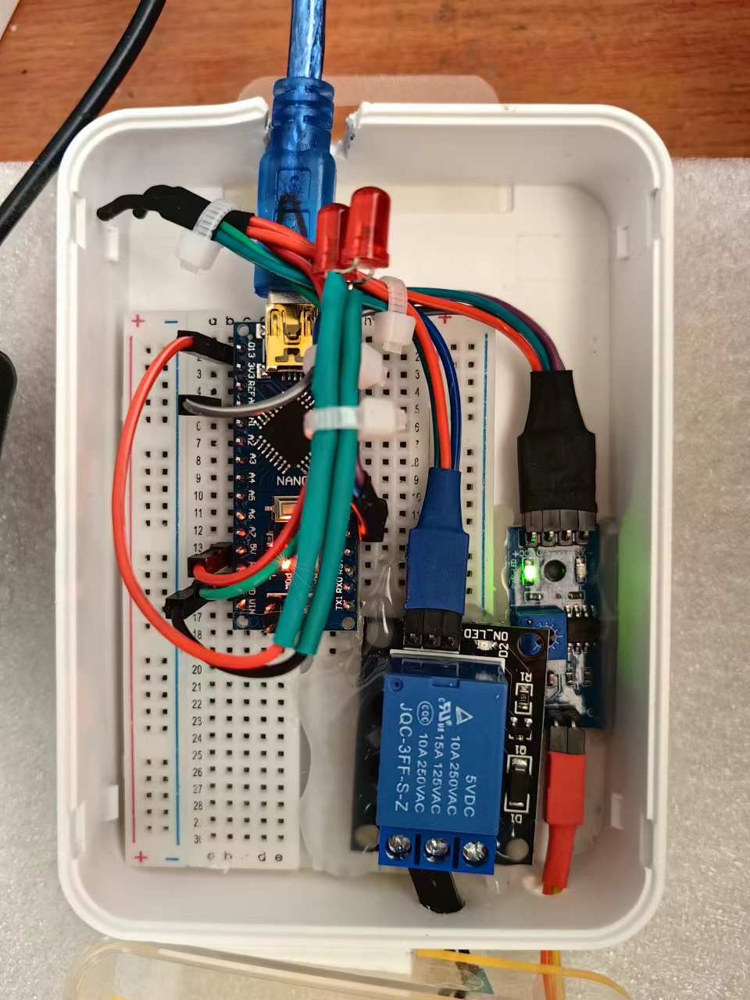
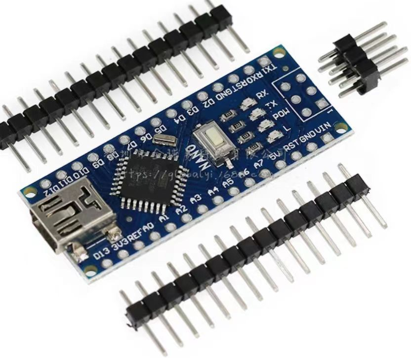
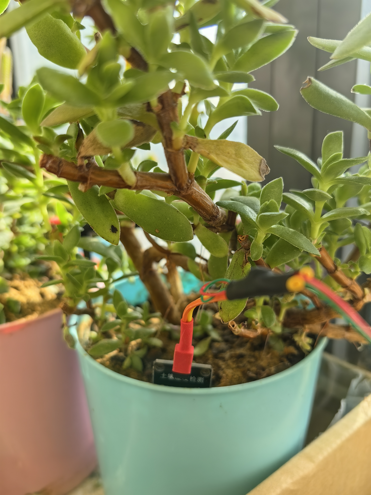

# 自动浇花系统

1. **简述**

   - 为啥要自动浇花？

     因为懒得天天手动浇

     
   
   - 我看用到了智能插座，为什么不直接用智能插座设置自动浇水，还要添加额外的硬件进行控制？
   
     智能插座控制水泵浇水是我早期的做法，但，有很多缺点
   
     - 稳定性差，有多次，智能插座开启水泵后，关闭时程序出错，导致水泵关闭失败，水溢出，流的到处都是
   
     - 浇水效果受浇水时长、喷头流量、喷头堵塞、阳光光照和空气温湿度等影响，若只用智能插座，则需要时不时手动调整系统中的一些硬件参数（比如浇水时长、喷头流量等）并多次测试，才能达到满意的效果。
   
       这与我使用自动浇水的初衷是相悖的，我用自己动浇水就是懒得每天浇水，更别提时不时让我调整这些硬件和测试了。
   
       
   
   - 代码为什么不用简单的while循环或者更高级一点的看门狗而是用中断+计数？
   
     - 这个跟Arduino的学习进度和深度有关系。
   
       目前还处于Arduino入门阶段，还没有学到看门狗。而且看门狗看起来稍微复杂，学习成本有点高，所以，暂时没用到。
   
       至于while循环，太占资源而且费电，并且是偷懒的方式，不利于Arduino的进一步学习。
   
       其次，考虑到后面有可能继续对自动浇花系统进行升级（比如，加入太阳追踪电池板发电和锂电池，土壤湿度显示和旋钮调节触发湿度值等功能），需要用到计算资源，所以，选择了中断和计数的方式。
   
       
   
   - 大致的工作流程是怎样的？
   
     1. 智能插座在设定的时间段内接通控制电路电源
   
     2. 控制电路通电，每一秒对土壤湿度进行一次检测。当土壤湿度≥设定的条件值S时（这里土壤越干，值越高，值范围为[0, 1023]），启动水泵浇水。
   
     3. 当检测器检测到湿度小于S值的时间达到设定的时间T1时，关闭水泵。
   
     4. 当水泵运行时间Tp超过设定的值Tpl时，不管3的条件是否达到，都会关闭水泵，防止长时间浇水或者空转。并标记水桶没水，报警灯和nano板上的13号引脚LED灯会亮一秒灭一秒，进行水桶缺水提示。
   
     5. 当下次3的条件达到时，由于水桶被标记缺水，水泵不会通电。这样，就防止了水泵空转，大大延长水泵寿命。
   
        
   
   - 如果解除缺水报警？
   
     - 水桶灌满水，然后按一下nano上的按钮即可。
     - 或者水桶灌满水，等智能插座下次给控制电路通电即可。

2. 硬件组成

   1. 控制电路

      ​	

      1. Arduino nano V3（国产改进版）

         

      2. 电磁继电器（见控制电路成品图）

      3. 土壤湿度检测器（见控制电路成品图）

      4. 土壤湿度检测器花盆端

         检测器花盆端由30AWG的OK跳线延长，实测对比非延长线的土壤湿度检测器，数值影响可以忽略
      
         
      
      5. 水桶缺水备份报警灯（见控制电路成品图中两个大号红色LED）

   2. 智能插座

      - 用于控制浇花的时间段，尽量选择有人在场的时间段进行浇水，防止各种意外发生（比如，水泵开了没关上，抽水抽的满地都是。电路在不可抗力的影响下着火了等等）。

        

   3. 水管喷头（图中花盆中带红色头部的水管）

      

   4. 水桶和水泵

      

---

